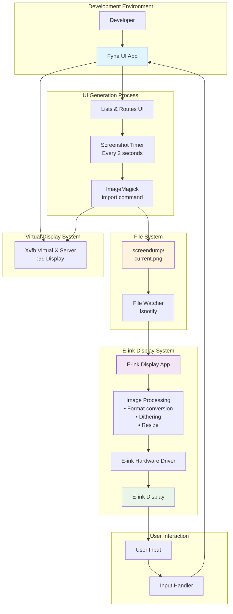

# Penny Black

This is a project to build an e-ink reader for the Raspberry Pi zero.
It's a hobby project to learn about Go, e-ink displays and Raspberry Pi.
also I want to use a dial to navigate the UI.

