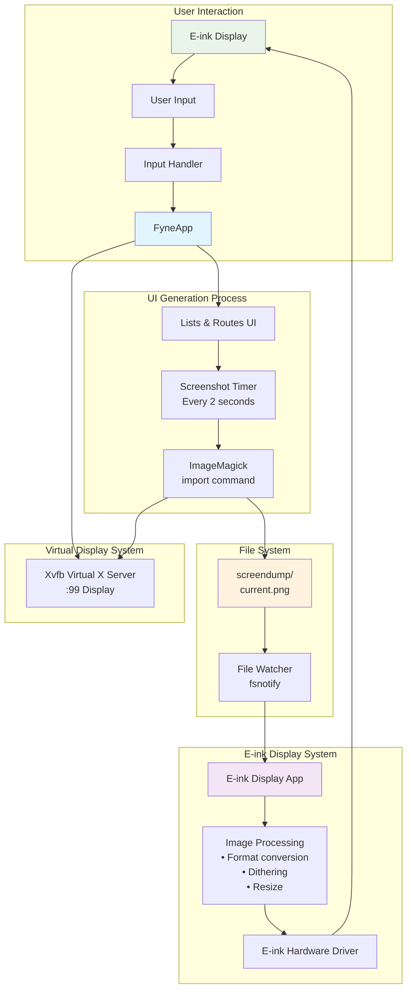

# Penny Black

This is a project to build an e-ink reader for the Raspberry Pi zero.
It's a hobby project to learn about Go, e-ink displays and Raspberry Pi.
also I want to use a dial to navigate the UI.

## Structure

### App 
this is a gui for the user to interact with. there is no touch so it will be controller based
- Views
    - Lists
    - Book/:id
    - Settings

### cmd
this will be the backend for the app. it will be responsible for the following:
- generating a list of books from files in the books directory (in toml format)
- take a screenshot of the gui for the e-ink display 0.5 seconds refresh rate
    - for development purposes Xvfb will be used for the virtual display

## Run GUI

```
go run app/*.go
```




## Fonts

https://www.dafont.com/bitmap.php

### Setup Fonts in Fyne

https://github.com/lusingander/fyne-font-example